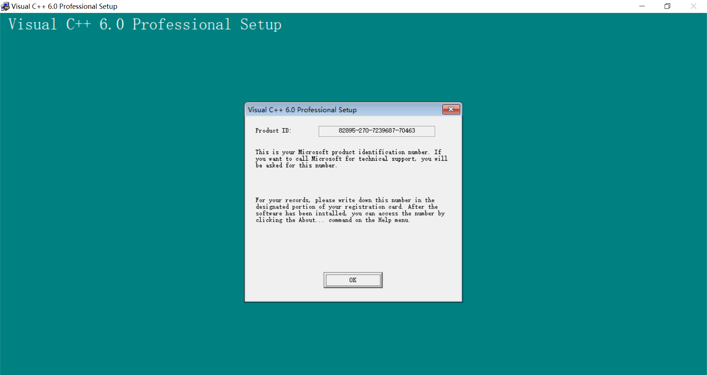
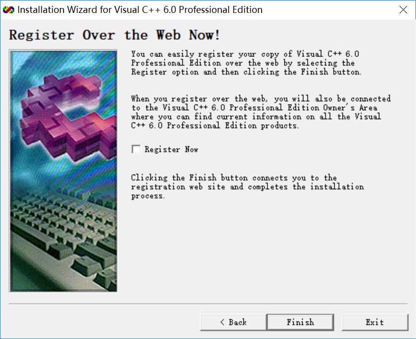

## 前期准备
- 在网上下载Microsoft Visual C++6.0压缩包,就语种来说有中文版和英文版。
- 安装前建议关闭360管家这个流氓软件
## 安装过程
- 将压缩包解压后打开文件，找到SETUP.EXE，打开，进入安装界面，
- 按照提示一步步安装
- 点击NEXT
- 勾选接受然后下一步
- 三个位置都可以随意填写，Next
- Next
- Continue
- OK，等待一会
- 这个时候注意点击Custom（网上教程一般是让我们选Typical典型安装，但我用这项的时候安装程序会卡死），
- 选中**Data Access**然后点击**Change Option**，并在接下来的页面再次点击**Change Option**
- 取消勾选***ADD and RDS*****OK，OK,OK,Continue**
- **OK**！！
- 等待安装
- 确定
- OK！
- 取消勾选**Install MSDN** ，Next
- Y
- 取消勾选，然后Finish
## 碰到的问题（中文版）
- 中文版本，安装过程基本一样。问题在于安装完成后Microsoft Visual C++ 6.0可能会打不开，出现"应用程序无法正常启动（0xc0000142）"的问题。
- 解决：找到**英文版本**文件下的**COMMON/MSDEV98/BIN/MSDEV.EXE**(启动程序)复制到你安装的**中文版本的COMMON/MSDEV98/BIN**下，替换。安装的中文版本启动程序可以通过查看Microsoft Visual C++ 6.0快捷方式的 **属性-快捷方式-目标** 找到
## 后记
- 我的系统是WIN10，所以以上就WIN10系统测试，其他的系统可能没这么多问题，毕竟这个Microsoft Visual C++ 6.0的年纪都跟我们差不多了。
- 互相学习，如有错误，欢迎指出。
## 版权
Copyright © 2017 yangtze-kenzo, All Rights Reserved

